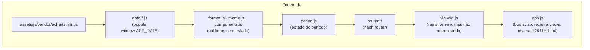

# Arquitetura

Este documento descreve como as peças do mockup se encaixam: ordem de carregamento,
os contratos entre camadas (dados → período → views → gráficos) e as convenções que
mantêm as sete telas consistentes entre si. Para o pitch do produto e o roteiro de
apresentação, veja o [README](README.md).

## Visão geral

É um site estático de uma página só (`index.html`), sem bundler, sem build e sem
módulos ES — tudo roda como `<script>` clássico carregado em ordem, na própria tag
`<body>`. Não há backend: cada "fonte de dados" é um objeto JavaScript literal em
`data/*.js`, atribuído a `window.APP_DATA` assim que o script carrega.



A ordem importa: um script que lê `APP_DATA`, `APP_THEME`, `UI`, `fmt` ou `PERIOD`
antes dele ter sido definido quebra silenciosamente (variável `undefined`). Ao
adicionar um arquivo novo, insira a tag `<script>` no bloco certo — veja
["Adicionando uma nova tela"](#adicionando-uma-nova-tela).

## Camada de dados (`data/*.js`)

Cada arquivo estende `window.APP_DATA` com uma chave por fonte (`agenda`, `os`,
`crm`, `incubadora`, `educacao`, `metas`). A convenção que atravessa todos eles:

- **Séries mensais, nunca totais fixos.** Toda métrica que varia no tempo é um
  array de 9 posições, índice `0`–`8` = Janeiro–Setembro/2026, alinhado com
  `months`/`monthLabels`. Nenhuma view digita um total pronto — tudo é somado em
  runtime por `period.js` a partir dessas séries, então Visão Geral e as telas de
  detalhe nunca divergem entre si.
- Estruturas auxiliares (tabelas de "próximos agendamentos", rankings, listas por
  cidade) são arrays de objetos simples, sem série temporal — usadas direto pelas
  views que precisam delas.
- Comentários no topo de cada arquivo registram a origem real do número (print,
  planilha, aba) e o que é estimativa — mantenha esse rastro ao editar ou adicionar
  dados; é o que sustenta a tabela "Origem dos dados" do README.

## Estado de período (`assets/js/period.js`)

`window.PERIOD` é a única fonte de verdade sobre qual recorte de tempo está ativo
(`ytd`, `q3`, `mes` — ver `PRESETS`). Ele expõe apenas operações de agregação sobre
um array mensal de 9 posições:

| Função | Uso |
|---|---|
| `PERIOD.sum(arr)` | total do período — a maioria dos KPIs |
| `PERIOD.avg(arr)` | média do período |
| `PERIOD.last(arr)` | último mês do período — indicadores tipo "snapshot" |
| `PERIOD.slice(arr)` | recorte preservando o eixo do tempo — séries para gráficos |
| `PERIOD.monthsInRange()` | quantos meses o período cobre |

`PERIOD.onChange(fn)` é assinado pelo router; trocar o período dispara um
re-render completo da view atual (`router.js` chama `render()` de novo). Views
nunca guardam o período localmente — sempre leem `PERIOD` no momento do `render()`.

## Router (`assets/js/router.js`)

Hash router mínimo. Cada rota é registrada por `ROUTER.register(path, view)` em
`app.js`, e uma view é um objeto com este contrato:

```js
{
  title: "Título exibido na topbar",
  subtitle: "Subtítulo opcional",
  render(): string,              // HTML da tela; síncrono, sem side effects
  mount({ registerChart }): void // opcional; instancia gráficos ECharts
}
```

Ao navegar, o router: descarta (`dispose()`) todas as instâncias ECharts da view
anterior, injeta o HTML de `render()`, e chama `mount()` se existir — todo
`echarts.init(...)` feito dentro de `mount()` **precisa** passar por
`registerChart(instance)`, senão o router não consegue liberá-lo na próxima troca
de tela (vazamento de memória e "gráfico fantasma" sobreposto).

Se `mount()` lançar uma exceção (por exemplo, `echarts` não carregou), o router
captura o erro e substitui cada `.chart-box` vazio por um aviso visível
(`markChartsFailed`) em vez de deixar a tela com buracos em branco sem explicação
— esse é justamente o modo de falha que já chegou a acontecer em produção, então
não remova esse `try/catch` nem o fallback.

## Componentes de UI (`assets/js/components.js`)

`window.UI` é uma biblioteca de funções puras — recebem dados, devolvem uma string
HTML — usada por todas as views para não reimplementar marcação repetida:

| Componente | Para quê |
|---|---|
| `kpiCard` | cartão de indicador, com sparkline e tendência opcionais |
| `sectionCard` | cartão com cabeçalho (eyebrow/título/descrição) + corpo livre |
| `chartBox(id, height)` | `<div>` vazia com o `id` que `mount()` vai usar em `echarts.init` |
| `progressBar` / `miniBar` | barra de progresso (tela cheia ou dentro de célula de tabela) |
| `statusPill` | selo colorido para status textual (mapa fixo em `statusPill`) |
| `dataTable` | tabela genérica a partir de `columns`/`rows` |
| `axisTile` | ladrilho de indicador secundário com sparkline |
| `sparkline` | SVG inline (não depende do ECharts — nunca fica em branco) |

Qualquer texto vindo de dado livre (nome de evento, cidade, etc.) deve passar por
`UI.esc()` antes de entrar no HTML — é a única barreira contra XSS neste projeto,
já que não há template engine com escaping automático.

## Tema dos gráficos (`assets/js/theme.js`)

`window.APP_THEME` centraliza paleta e defaults do ECharts para que os sete
gráficos de cada tela pareçam parte do mesmo produto. Regras que já foram
validadas (`SERIES_PALETTE` passou por um script de validação de contraste e
daltonismo) e que devem ser respeitadas ao adicionar um gráfico novo:

- **Ordem fixa da paleta categórica** (`SERIES_PALETTE`) — nunca cicle nem
  reordene para "combinar" com uma tela específica; uma 7ª série vira "Outros" ou
  vai para um segundo gráfico.
- **"Relief" obrigatório** — como três das seis cores da paleta ficam abaixo de
  3:1 de contraste sobre branco, nenhum gráfico pode depender só da cor para
  transmitir significado: sempre com legenda e/ou rótulo direto.
- **Rampa sequencial única** (`SEQUENTIAL`) para magnitude contínua (mapas de
  calor) — claro → escuro, nunca arco-íris.
- **Cores de estado** (`STATUS.good/warning/critical/neutral`) são reservadas
  para status (bom/atenção/crítico) e nunca reaproveitadas como "série N".
- Tema é **claro fixo, sem dark mode** — decisão deliberada (ver comentário em
  `assets/css/tokens.css`) para manter a leitura idêntica à dos sistemas de origem
  (Agenda/O.S.) em qualquer projetor ou navegador. Não adicione branch por
  `prefers-color-scheme`.

## Convenção de cada view (`views/*.js`)

Todas as sete views seguem a mesma forma interna, exemplificada em
`views/visao-geral.js`:

1. `computeKpis()` (ou equivalente) — função pura que lê `window.APP_DATA` e
   `PERIOD`, devolve os números já agregados do período ativo.
2. `render()` — monta e devolve uma string de HTML usando os componentes de `UI`
   e `fmt` (formatação pt-BR); não toca no DOM diretamente, não instancia gráfico.
3. `mount({ registerChart })` — depois que `render()` já injetou o HTML no DOM,
   busca cada `chart-box` por `id`, chama `echarts.init` e `registerChart` nele, e
   define as `option` do gráfico.
4. A view se expõe em `window.VIEW_<NOME>` (ex.: `window.VIEW_VISAO_GERAL`).

## Adicionando uma nova tela

1. Criar `data/<fonte>.js` seguindo a convenção de séries mensais acima.
2. Criar `views/<tela>.js` seguindo o contrato `{ title, subtitle, render, mount }`.
3. Em `index.html`, adicionar `<script src="data/<fonte>.js">` no bloco de dados
   (antes de `format.js`) e `<script src="views/<tela>.js">` no bloco de views
   (depois de `router.js`, antes de `app.js`).
4. Em `index.html`, adicionar o item de navegação em `.sidebar-nav` com o
   `data-route` correspondente.
5. Em `assets/js/app.js`, registrar a rota dentro de `registerViews()`:
   `ROUTER.register("<tela>", VIEW_<NOME>)`.

## Decisões deliberadas (não "corrigir" sem contexto)

Estas escolhas estão documentadas em comentários no próprio código e existem por
um motivo específico — revertê-las reintroduz um defeito já visto em produção ou
quebra uma garantia que o resto do painel depende:

- Fallback visível quando o ECharts falha ao carregar (`app.js` → `checkChartsLibrary`,
  `router.js` → `markChartsFailed`) em vez de tela com gráficos em branco.
- Nenhum KPI como número fixo — sempre derivado de série mensal via `PERIOD`.
- Tema claro fixo, sem dark mode.
- Paleta de gráfico com ordem fixa e regra de "relief" (ver seção de tema acima).
